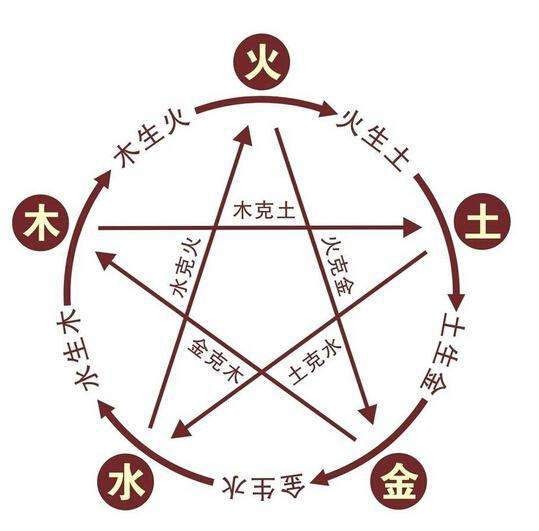

# 一、哲学基础

**天人合一**：命理学的哲学思想。天，就是自然界；人，就是人类。天人合一就是说人类是天地万物中的一部分，人与自然是息息相通的一体。

在古代先哲的眼里，世界上的一起都是由“气”构成的。所谓“气”就是指一种极其精微的原始物质。它是构成包括人在内的天地万物的最基本元素，是世界的本原。

阴阳
------

天地之气，动而不息。运动是“气”的根本属性。而运动变化的根源，则来自于“气”自身固有的阴和阳两个方面的力量。

阴阳最初的含义很简单，朝向日光的为“阳”，背向阳光的为“阴”。战国初期道家学派把阴阳带进了哲学殿堂。道家解释万物的演化过程时，把未分阴阳的混沌世界看做是“一”。于是“一生二”，便有了天地之分，有了阴阳之分。世界上的所有事物都可以规划为两方面：阳和阴。

阴阳相互渗透，相互作用，它们构成了气的矛盾统一体。这样，一气分为阴阳，阴阳又同一于气。物质世界正式在阴阳二气的相互作用之下，不断的运动变化着。

最能反映阴阳互根、阴阳消长的是古代易学中的太极图。途中黑白二色，代表阴阳两方。白中黑点表示阳中有阴，黑中白点表示阴中有阳。负阴而抱阳，阳中有阴，阴中有阳。分之为二，合之为一。然而，阳中又有至阳，阴中尚有至阴。阴极则阳生，阳极则阴长，于是构成了一幅完整的最能表示阴阳对立同一关系的太极图。

五行
------

“天降阳，地出阴，阴阳合而生五行”。由于阴阳二气的相互作用产生了五行：金、木、水、火、土。“行”是指这五种物质的运动和变化，也就是五种物质的内在属性和外在状态。

古人将“气”看做是宇宙逇最基本元素以后，五行就被用来描写五种“气”的状态和性质。或者说，古人用五行-五类物质独特的抽象特征，来归纳世界上的各种事物，并且以它们之间存在的“相生”，“相克”以及制化关系，来阐述宇宙中各种事物或现象之间的相互联系及协调平衡。

**五行相生**：金生水、水生木、木生火、火生土、土生金。 

  - 金生水: 因为少阴之气(金气)温润流泽，金靠水生，销锻金也可变为水，所以金生水。
  - 水生木: 因为水温润而使树木生长出来，所以水生木。
  - 木生火: 因为木性温暖，火隐伏其中，钻木而生火，所以木生火。
  - 火生土: 因为火灼热，所以能够焚烧木，木被焚烧后就变成灰烬，灰即土，所以火生土。
  - 土生金: 因为金需要隐藏在石里，依附着山，津润而生，聚土成山，有山必生石，所以土生金。
  
**五行相克**：金克木、木克土、土克水、水克火、火克金。

  - 金克木: 因为金属铸造的割切工具可锯毁树木。（有矿的土地不长草）
  - 木克土: 因为树根吸收土中的营养，以补己用，树木强壮了，土壤如果得不到补充，自然削弱。
  - 土克水: 因为土能防水。（兵来将挡水来土掩）
  - 水克火: 因为火遇水便熄灭。
  - 火克金: 因为烈火能融化金属。 

# 二、干支符号

历法：天干地支
------

“干支”是天干和地支的简称，相传是四千六百余年前黄帝时代大尧氏所创。

天干最初是用来纪日的。古人以日出、日没为一天，用一个天干来标记；一旬或十天，正好是十个天干，按序为：甲、乙、丙、丁、戊、己、庚、辛、壬、癸。

地支，最初是用来纪月的。每一个月是用月亮的盈亏来计算。月亮盈亏一次就是一个月。地支有十二个，古时也称十二时辰，排序为：子、丑、寅、卯、辰、巳、午、未、申、酉、戌、亥。

十二个地支正好跟一年十二个月相配：正月建寅，卯为二月，辰为三月，巳为四月，午为五月，未为六月，申为七月，酉为八月，戌为九月，亥为十月，子为十一月，丑为十二月。

然而，单凭十个天干来纪日，则每个月可能有三个天干相同的日子，这就不容易辨别了。于是，就用一个天干和一个地址，按照次序搭配起来的办法来纪日期。这就产生了“干支纪日法”，也叫“甲子纪日法”。十天干和十二地支的最小公倍数是六十。按序组合的一次循环，即从甲子开始，至癸亥终了，天干循环六次，地支循环五次，共有六十个干支组合，成为“六十甲子”或“花甲子”。

# 推荐书籍
  * [八字命理学基础教程(陆致极)](https://www.aliyundrive.com/s/QvsPPCrLNmY)