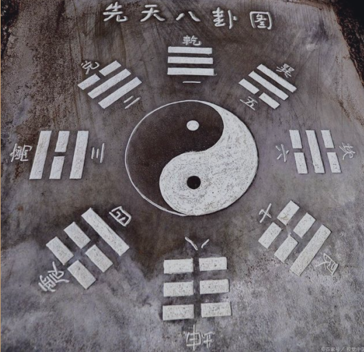

# 1. 卦象的组成

周易的一卦，由上卦和下卦组成。 
上下各为八卦之一，八卦及所代表的形象为： 

乾代表天，坤代表地，震代表雷，巽代表风， 
坎代表水，离代表火，艮代表山，兑代表泽（湖泊）。

# 2. 卦象的组成

八卦图形的记忆歌诀：

乾三连，坤六断。 
震仰盂，艮覆碗。 
离中虚，坎中满。 
兑上缺，巽下断。

# 3. 先天八卦与后天八卦

先天八卦和后天八卦的画法是一样的，不同的有三点： 

  1. 所处方位不同。 
  2. 所代表的的数字不同。 
  3. 区分阴阳卦的方法不同。 

《周易》所用的是后天八卦。 先天八卦的具体卦象目前发现的最早的是在宋朝，是邵康节先生画的。但是 其实在孔子的注释中，是可以找到先天八卦方位的蛛丝马迹的。

# 4. 天干地支

天干地支，简称为干支，源自中国远古时代对天象的观测。 

“甲、乙、丙、丁、戊、己、庚、辛、壬、癸”称为十天干。 
“子、丑、寅、卯、辰、巳、午、未、申、酉、戌、亥”称为十二 地支。

## 4.1. 天干

天干在古代是计时的符号之一。用来记年记日，代表十年或者十天。 

甲、丙、戊、庚、壬为单数，属阳；乙、丁、己、辛、癸为双数， 属阴。 

天干于五行五方对应：甲乙属木，对应东方；丙丁属火，对应南方； 
戊己属土，对应中央；庚辛属金，对应西方；壬癸属水，对应北方。

## 4.2. 天干与五行

甲为栋梁之木，乙为花果之木，甲乙东方木。丙为太阳之火，丁为 灯烛之火，丙丁南方火。 

戊为城墙之土，己为田园之土，戊己中央土。 

庚为斧钺之金，辛为首饰之金，庚辛西方金。壬为江河之水，癸为 雨露之水，壬癸北方水。

## 4.3. 地支

只用十天干计时的话，容易造成计时符号重复，老祖宗又创造了十二地支， 与天干相配合，表示月和时。也就是说十二个月份或十二个时辰。

子、寅、辰、午、申、戌为单数，为阳；丑、卯、巳、未、酉、亥为双数， 为阴。 

寅、卯属木，辰属土，它们同属东方，对应春天； 
巳、午属火，未属土，它们同属南方，对应夏天； 
申、酉属金，戌属土，它们同属西方，对应秋天； 
亥、子属水，丑属土，它们同属北方，对应冬天。

## 4.4. 地支与五行

子（鼠）属阳水，北方；亥（猪）属阴水，北方。 

寅（虎）属阳木，东方；卯（兔）属阴木，东方。 

午（马）属阳火，南方；巳（蛇）属阴火，南方。 

申（猴）属阳金，西方；酉（鸡）属阴金，西方。 

辰（龙）、戌（犬）属阳土，中央；丑（牛）、未（羊）属阴土， 中央。

# 5. 节气歌与干支

春雨（寅）惊春（卯）清谷天（辰），
 
夏满（巳）芒夏（午）暑相连（未）。
 
秋处（申）露秋（酉）寒霜降（戌）， 

冬雪（亥）雪冬（子）小大寒（丑）。